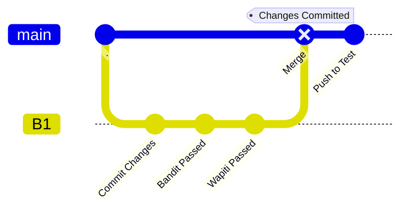
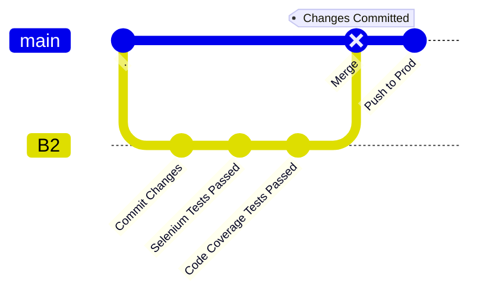

# Khaanvani - A Chatbot
------------------------------------------------------------------------------

This repository hosts a Chatbot project that serves as an intelligent virtual assistant capable of responding to text queries related to various Acts, Rules, and Regulations applicable to the Mining industry. It's designed to make the information retrieval process more efficient and user-friendly for people in the mining sector.
## Features

- 24/7 availability
- Text queries
- Ease of use

## Tech Stack

- Python

- LangChain

- Natural Language Processing (NLP)

- Pinecone

## Tools:

-Bandit for code vulnerability checking

-Wapiti for dynamic checking

-Pytest for testing

-Terraform for iac tool

## Demo
Visit our site at [khaanvaani.streamlit.app](https://khaanvaani.streamlit.app/)

## Our flowchart: Dev Repo

## Our flowchart: Test Repo

## Future

Regional languages

Voice search

Legal Representative

1 in chat

2 in call

